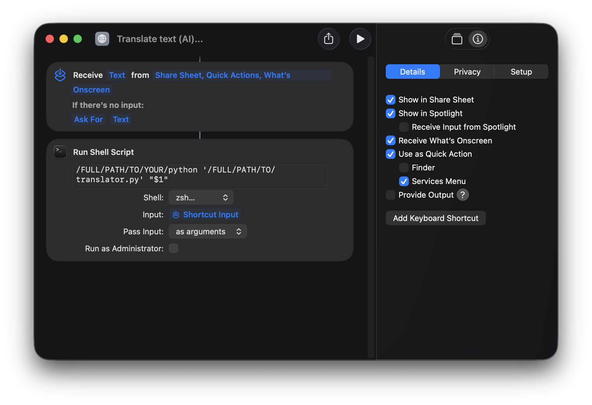

# 🌐 Mac 极速翻译小助手  (TranslateGemma)

**像使用原生功能一样，体验极致的 AI 翻译。**

这是一个专为 **Apple Silicon Mac (M1/M2/M3/M4)** 打造的高性能本地翻译工具。它利用 Apple 的 [MLX 框架](https://github.com/ml-explore/mlx) 在本地运行大语言模型（LLM）。

最大的亮点在于，它通过 macOS **快捷指令 (Shortcuts)** 与系统无缝集成。你可以**像使用系统原生功能一样，通过右键菜单或键盘快捷键唤起翻译**！

**无需 API Key。无需联网。100% 隐私安全。**

## 演示


https://github.com/user-attachments/assets/63cae308-71da-452e-8c8a-0f5a54464e74


## 📸 界面预览


## 🤖 关于模型与性能

本应用默认使用 **`translategemma-12b-it-4bit`**，这是一个基于 Google Gemma 微调的高质量翻译模型。

*   **性能表现**：得益于 MLX 框架对 Apple Silicon 的深度优化，该 12B 参数模型在 Mac 上的推理速度极快（通常快于人类阅读速度）。
*   **设备要求**：
    *   **芯片**：Apple M1/M2/M3/M4 系列芯片。
    *   **内存**：推荐 **16GB** 及以上统一内存。
    *   *注*：4-bit 量化模型占用约 8-9GB 显存。8GB 内存的 Mac 也可以尝试运行（建议关闭其他大型应用）。

## ✨ 核心功能

*   **🚀 即点即用 & 快速准确**：无需等待网络请求，无需联网。启动即用，提供高质量的翻译结果。
*   **🎨 原生 Mac 风格 UI**：
    *   **深度集成**：拥有完整的 **菜单栏 (Menu Bar)** 和 **Dock** 图标支持。
    *   **外观适配**：完美适配 macOS 的 **浅色模式** 和 **深色模式**。
    *   **精美图标**：使用原生风格图标（图标来源：[macOSicons.com](https://macosicons.com/#/)，你可以自行更换）。
*   **🧠 智能感知**：
    *   **自动字典模式**：输入单词/短语时，自动变为“字典”，提供音标、释义和例句。
    *   **多风格翻译**：支持默认、学术、闲聊、网络用语等多种风格。
*   **🔄 智能交互**：支持智能语言互换与单实例锁定。

## 🌍 支持语言列表

当前版本 App 内置支持以下语言：

*   简体中文 (zh)
*   繁體中文 (zh-Hant)
*   English (en)
*   日本語 (ja)
*   한국어 (ko)
*   Français (fr)
*   Deutsch (de)
*   Italiano (it)
*   Español (es)
*   Русский (ru)
*   Português (pt)
*   العربية (ar)
*   हिन्दी (hi)
*   Malti (mt)

> **📝 提示**：`translategemma` 模型实际支持多达 **55 种语言**。如果列表里没有你需要的语言，可以直接修改源代码中的 `self.languages` 自行添加。

## 📥 下载与安装 (Download & Setup)

在开始配置和使用之前，请先将本项目下载到本地，并安装必要的 Python 依赖库。

### 1. 获取代码
你可以通过 Git 克隆仓库，或者直接下载 ZIP 压缩包：

* **方法 A：使用 Git 克隆 (推荐)**
    打开终端 (Terminal)，运行以下命令：
    ```bash
    git clone https://github.com/Jingyuan-Zheng/Mac-Lite-Translator_TranslateGemma.git
    cd Mac-Lite-Translator_TranslateGemma
    ```

* **方法 B：下载 ZIP**
    点击页面右上角的绿色 **Code** 按钮 -> 选择 **Download ZIP**。
    下载完成后解压，并在终端中进入该文件夹路径：
    ```bash
    cd /你的/下载/路径/Mac-Lite-Translator_TranslateGemma
    ```

### 2. 安装依赖
确保你的电脑已安装 Python（建议 3.10 及以上版本）。在终端中运行以下命令，一次性安装所有必要的库（如 MLX 等）：

```bash
pip install -r requirements.txt
```

## ⚙️ 配置指南 (语言设置)

在运行应用之前，请使用文本编辑器（如 VS Code, 文本编辑, 或 Sublime Text）打开 `translator.py` 文件，设置您的常用语言。

找到文件顶部的 **USER CONFIGURATION (用户配置区)**：

```python
# ================= USER CONFIGURATION =================
USER_NATIVE_LANG = "简体中文"       # 您的母语
USER_PRIMARY_FOREIGN_LANG = "English"  # 您的主要学习/目标外语
# ======================================================
```
*   **作用**：这决定了默认的翻译方向。如果您复制的是中文，它会自动翻译成英文；反之亦然。
*   *注意：填写的语言名称必须与代码下方 `self.languages` 列表中的名称完全一致。*

## 🚀 安装与运行方式

我们提供三种运行方式，推荐使用 **快捷指令** 以获得最佳的原生体验。

### 方式 1：macOS 快捷指令 (推荐 - 原生体验)



【🤔 如果懒得折腾，你也可以直接从这个仓库里找到该快捷指令，然后把路径改一下就行啦～】

将翻译器集成到系统中，实现“选中文字 -> 右键 -> 翻译”的流畅体验。

1.  **获取 Python 解释器路径：**
    *   打开终端 (Terminal)。
    *   如果您使用 **Anaconda**，输入 `which python`。路径通常是 `/opt/anaconda3/bin/python`。
    *   如果您使用 **虚拟环境 (venv)**，请找到环境文件夹内的 python 可执行文件的绝对路径。
    *   *复制这个路径，稍后会用到。*

2.  **创建快捷指令：**
    *   打开 **快捷指令 (Shortcuts)** App。
    *   点击 `+` 新建快捷指令。
    *   **右侧侧边栏设置 (信息/i 图标)：**
        *   勾选 **“在共享表单中显示”**。
        *   勾选 **“作为快速操作使用”** (Use as Quick Action)。
        *   确保勾选 **“服务菜单”** 和 **“访达”**。
        *   *(可选)* 点击 **“添加键盘快捷键”** 并设置一个热键（如 `control+T`）。
    *   **编辑工作流：**
        *   **接收：** 设置为 “从 **快速操作、共享表单** 等接收 **文本**”。
            *   *(建议设置“如果没有输入：请求文本”)*。
        *   **操作：** 搜索并拖入 **“运行 Shell 脚本”**。
        *   **Shell：** 选择 `/bin/zsh`。
        *   **输入：** 务必选择 **“作为参数”** (as arguments)。这是最关键的一步！
        *   **脚本内容：** 输入以下命令（请替换为您实际的路径）：

        ```bash
        # 模板
        /您的/Python/绝对路径 '/您的/脚本/translator.py/绝对路径' "$1"
        
        # 示例 (Anaconda 用户)：
        /opt/anaconda3/bin/python '/Users/yourname/Documents/translator.py' "$1"
        ```

3.  **如何使用：**
    *   在任何 App (Chrome, PDF, 备忘录等) 中选中一段文字。
    *   **右键** -> **服务** -> **Translate Text** (或者您的快捷指令名称)。
    *   (或者直接按下您刚才设置的键盘快捷键)。

### 方式 2：制作独立 App (Automator)

如果您希望在 Dock 栏或启动台有一个可点击的 App 图标。

1.  打开 Mac 上的 **自动操作 (Automator)**。
2.  新建文档，选择 **“应用程序”** (Application)。
3.  搜索 **“运行 Shell 脚本”** 并双击添加。
4.  输入启动命令（与上方类似，但不需要 "$1"，除非您想支持拖拽文件）：
    ```bash
    /opt/anaconda3/bin/python '/Users/yourname/Documents/translator.py'
    ```
5.  按 Cmd+S 保存，命名为 `AI Translator.app`，将其拖入“应用程序”文件夹即可。

### 方式 3：命令行运行 (Terminal)

适合开发者调试或习惯终端的用户。

*   **直接运行：**
    ```bash
    # 请确保您已激活相应的 Python 环境
    python translator.py
    ```
*   **管道输入 (Pipe)：**
    非常适合配合其他脚本使用。
    
    ```bash
    echo "This is a test sentence." | python translator.py
    ```
*   **带参运行：**
    ```bash
    python translator.py "Hello world"
    ```

## ❓ 常见问题 (FAQ)

**Q: 是否支持多模态（即读取图片翻译）？**

**A:** 不支持。虽然 Google 原版 Gemma 支持，但目前的 HuggingFace MLX 版本暂不支持。
*细节*：我们测试过多模态版本，但由于无法实现流式输出且速度较慢，为了保证最佳体验，暂未加入。

**Q: 能否使用 Ollama 作为后端？**

**A:** 暂时没有提供。在 Mac 平台上，**MLX** 的速度和内存效率远高于 Ollama，因此我们首选 MLX。

**Q: 支持 Windows 或 Linux 吗？**

**A:** 理论上支持，但需要修改代码。你需要移除 macOS 专用的 UI 代码（如 AppKit、Dock 图标），并将 `mlx-lm` 替换为 `ollama` 或 `transformers` 才能在其他平台上运行。
