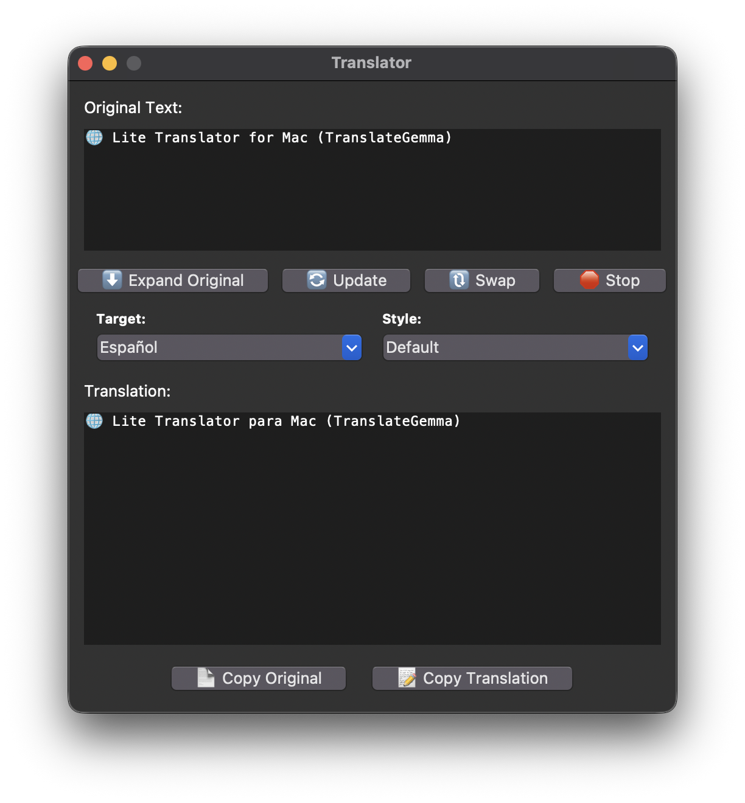

# 🌐 Lite Translator for Mac (TranslateGemma)

中文说明可点击下方：
- [简体中文](README-zh.md)

**Experience AI translation that feels native to macOS.**

This is a high-performance local translation tool built specifically for **Apple Silicon Macs (M1/M2/M3/M4)**. Powered by Apple's [MLX framework](https://github.com/ml-explore/mlx), it runs Large Language Models (LLMs) entirely on your device.

The best part? It integrates seamlessy into your system via **macOS Shortcuts**. You can **translate text with a Right-Click or a Keyboard Shortcut** from any app—just like a built-in system feature!

**No API keys. No internet required. 100% Private.**

## Demo


https://github.com/user-attachments/assets/63cae308-71da-452e-8c8a-0f5a54464e74


## 📸 Screenshots



## 🤖 About the Model & Performance

This application uses **`translategemma-12b-it-4bit`**, a specialized fine-tune of Google's Gemma model optimized for translation tasks.

*   **Performance:** On Apple Silicon, the MLX framework allows this 12B parameter model to run with exceptional speed (often exceeding reading speed).
*   **Hardware Requirements:**
    *   **Chip:** Apple M1/M2/M3/M4 (Pro/Max/Ultra recommended for best speeds, but base chips work).
    *   **RAM:** **16GB Unified Memory** is recommended.
    *   *Note:* The 4-bit quantized model requires approximately 8-9GB of RAM. It may run on 8GB machines if no other heavy apps are open.

## ✨ Features

*   **🚀 Instant & Accurate:** Click and use immediately. Delivers high-quality translations without needing an internet connection (once the model is downloaded).
*   **🎨 Native Mac UI:**
    *   **System Integration:** Supports macOS **Menu Bar** and **Dock** operations.
    *   **Theme Support:** Automatically adapts to **Light Mode** and **Dark Mode**.
    *   **Beautiful Icon:** Features a native-style icon (Source: [macOSicons.com](https://macosicons.com/#/), you can customize it easily).
*   **🧠 Context Aware:**
    *   **Auto-Dictionary Mode:** Detects single words/phrases and automatically provides definitions, phonetics (IPA), and examples.
    *   **Smart Style Switching:** Choose between *Default, Academic, Casual, Web Chat*, and more.
*   **🔄 Smart Swap:** Swapping languages automatically detects the original text language to reset the target direction.

## 🌍 Supported Languages

The app comes pre-configured with the following languages:

*   English
*   Simplified Chinese (简体中文)
*   Traditional Chinese (繁體中文)
*   Japanese (日本語)
*   Korean (한국어)
*   French (Français)
*   German (Deutsch)
*   Italian (Italiano)
*   Spanish (Español)
*   Russian (Русский)
*   Portuguese (Português)
*   Arabic (العربية)
*   Hindi (हिन्दी)
*   Maltese (Malti)

> **📝 Note:** The underlying `translategemma` model actually supports **55 languages**. If your desired language is not listed, you can easily add it by modifying the `self.languages` list in the source code.

## 📥 Download & Setup

Before configuring or running the app, you need to download the source code and install the required dependencies.

### 1. Get the Code
You can clone the repository via Git or download the ZIP file directly.

* **Method A: Git Clone (Recommended)**
    Open your Terminal and run:
    ```bash
    git clone https://github.com/Jingyuan-Zheng/Mac-Lite-Translator_TranslateGemma.git
    cd Mac-Lite-Translator_TranslateGemma
    ```

* **Method B: Download ZIP**
    Click the green **Code** button at the top right of this page -> Select **Download ZIP**.
    Unzip the file and navigate to the folder in your Terminal:
    ```bash
    cd /path/to/your/downloaded/Mac-Lite-Translator_TranslateGemma
    ```

### 2. Install Dependencies
Make sure you have Python installed (Python 3.10+ is recommended). Run the following command to install all required libraries (including MLX) listed in `requirements.txt`:

```bash
pip install -r requirements.txt
```

## ⚙️ Configuration (Language Setup)

Before running the app, open `translator.py` in any text editor (like VS Code, TextEdit, or Sublime Text) to set your preferred languages.

Look for the **USER CONFIGURATION** section near the top:

```python
# ================= USER CONFIGURATION =================
USER_NATIVE_LANG = "English"           # Your Native Language
USER_PRIMARY_FOREIGN_LANG = "Español"  # Your Primary Target Language
# ======================================================
```
*   **Why do this?** This determines the default translation direction. If you copy text in your native language, it auto-translates to the foreign one, and vice versa.
*   *Note: Ensure the language names match exactly with the `self.languages` list further down in the code.*

## 🚀 Installation & Usage Methods

You can run this tool in three ways. Choose the one that fits your workflow.

### Method 1: macOS Shortcuts (Recommended - Native Experience)


[🤔 If you are lazy, you can just download the shortcut on this repository and change the path in the shortcut.]

Integrate the translator directly into macOS so you can right-click any text to translate it.

1.  **Find your Python Path:**
    *   Open Terminal.
    *   If you use **Anaconda**, type: `which python` (make sure your conda env is active). It usually looks like `/opt/anaconda3/bin/python`.
    *   If you use a **Virtual Environment**, use the absolute path to the python executable inside it (e.g., `/Users/name/my_project/.venv/bin/python`).
    *   *Copy this path, you will need it.*

2.  **Create the Shortcut:**
    *   Open the **Shortcuts** app.
    *   Click `+` to create a new shortcut.
    *   **Right Sidebar (Info/i):**
        *   Check **"Show in Share Sheet"**.
        *   Check **"Use as Quick Action"**.
        *   Ensure **"Services Menu"** and **"Finder"** are selected.
        *   *(Optional)* Add a keyboard shortcut (e.g., `control+T`).
    *   **The Workflow Actions:**
        *   **Input:** Set to "Receive **Text** from **Quick Actions, Share Sheet**".
        *   **Action:** Drag in **"Run Shell Script"**.
        *   **Shell:** Select `/bin/zsh`.
        *   **Pass Input:** Select **"as arguments"** (Crucial!).
        *   **Script:** Enter the command below (replace paths with yours):

        ```bash
        # Template
        /FULL/PATH/TO/YOUR/python '/FULL/PATH/TO/translator.py' "$1"
        
        # Example (Anaconda User):
        /opt/anaconda3/bin/python '/Users/yourname/Documents/translator.py' "$1"
        ```

3.  **How to use:**
    *   Highlight text in **any app** (Chrome, PDF, Notes, etc.).
    *   Right-Click -> **Services** -> **Translate Text**.
    *   (Or use the keyboard shortcut you defined).

### Method 2: Create a Standalone App (via Automator)

If you prefer a clickable app icon in your Dock or Launchpad.

1.  Open **Automator** on your Mac.
2.  Choose **"Application"** as the document type.
3.  Search for **"Run Shell Script"** and double-click to add it.
4.  Set **Pass input** to **"as arguments"**.
5.  Paste the same command as above:
    ```bash
    /opt/anaconda3/bin/python '/Users/yourname/Documents/translator.py'
    ```
    *(Note: You don't need "$1" here if you just want to open the empty window).*
6.  Save it as `AI Translator.app` to your Applications folder.

### Method 3: Command Line (Terminal)

For developers or debugging.

*   **Direct Run:**
    ```bash
    # Ensure you are in the correct directory or use full paths
    python translator.py
    ```
*   **Pipe Text (Instant Translate):**
    Great for scripting.
    ```bash
    echo "This is a test sentence." | python translator.py
    ```
*   **With Arguments:**
    ```bash
    python translator.py "Hello world"
    ```

## ❓ F.A.Q.

**Q: Does it support Multimodal input (Images)?**

**A:** No. While Google's original Gemma model supports multimodal input, the current MLX version on HuggingFace does not.
*Detail:* I tested a custom multimodal implementation, but it was excluded because it lacks streaming support and is significantly slower than the text-only version.

**Q: Can I use Ollama instead of MLX?**

**A:** Technically yes, but not in this repo. On macOS, **MLX** is significantly faster and more memory-efficient than Ollama due to direct optimization for Apple Silicon.

**Q: Does this work on Windows or Linux?**

**A:** Not out of the box. The UI is cross-platform (`tkinter`), but you would need to remove the macOS-specific code (AppKit, Dock icons) and replace the `mlx-lm` backend with `ollama` or `transformers`.
