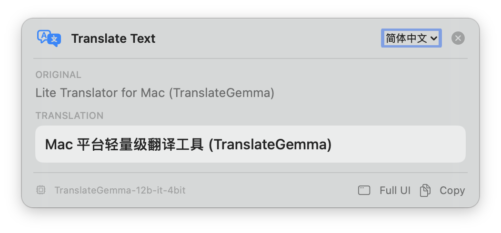
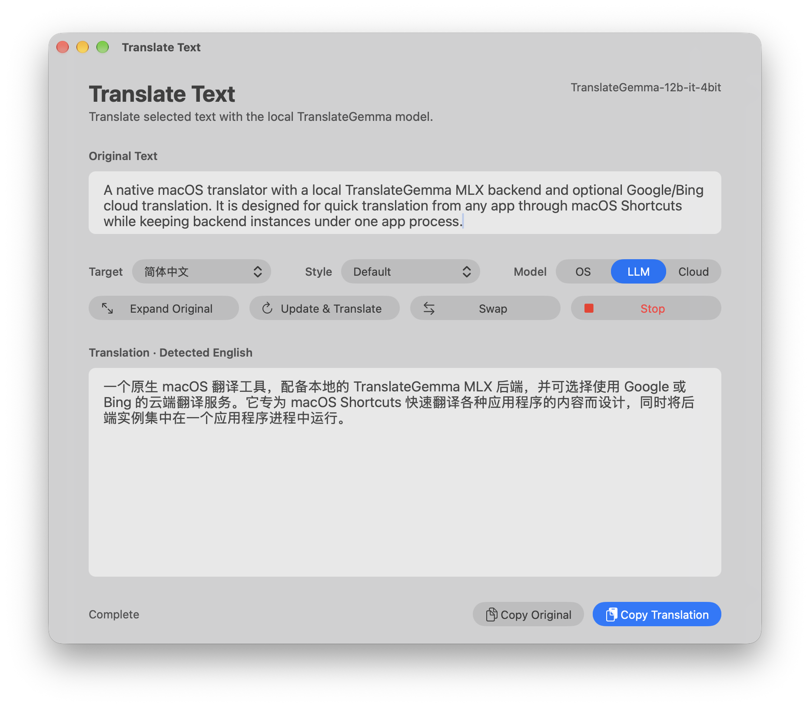

# Mac Lite Translator for TranslateGemma

[简体中文](README-zh.md)

A native macOS translator with three selectable backends: **OS** (Apple’s system Translation framework), **LLM** (a local TranslateGemma MLX model), and **Cloud** (Google, Bing, and DeepL fallback services). It is designed for quick translation from any app through macOS Shortcuts while keeping backend instances under one app process.

## Highlights





- Native AppKit interface with light/dark appearance support.
- Three modes in the full UI: OS system translation, local LLM translation through `mlx-lm`, and cloud translation.
- OS mode uses Apple’s Translation framework and downloaded system language packs; cloud-mode failure falls back to OS translation when available.
- Google, Bing, and DeepL cloud fallbacks, with configurable service order and no API key required.
- Runtime OS/LLM/Cloud switching. Once loaded, the local LLM remains resident until the app exits.
- `--light` opens a compact animated floating UI without a Dock icon; it can switch to the full UI.
- macOS Shortcuts friendly: selected text can be sent from the Services menu or a keyboard shortcut.
- Single-instance runtime: repeated Shortcut calls reuse the existing app window and backend instead of loading another model copy.
- Auto target-language switching and source-language detection.
- Translation styles: Default, Academic, Web Chat, Casual, and Dictionary.
- English and Simplified Chinese GUI, with Auto mode based on the system language.
- Settings include a default startup mode, and the native About panel includes localized credits and project links.

## Requirements

- Apple Silicon Mac.
- macOS 15 or later for the OS translation mode. LLM and cloud modes still require Apple Silicon for the maintained app build.
- Python 3.10+ with `mlx-lm`.
- A local TranslateGemma MLX model folder, for example `translategemma-12b-it-4bit`.
- 16GB unified memory is recommended for the 12B 4-bit model.

## Install Dependencies

Use the Python environment you want the app to use:

```bash
pip install -r requirements.txt
```

If the dependencies are installed in a non-default Python environment, set `TRANSLATE_TEXT_PYTHON` when launching the app from Shortcuts.

## Build the App

```bash
python3 App/build_app.py
```

The app bundle is created at:

```text
outputs/Translate Text.app
```

You can move it to `/Applications` if you want:

```bash
cp -R "outputs/Translate Text.app" /Applications/
```

## First Launch

1. Open `Translate Text.app`.
2. Choose `Settings...` from the app menu.
3. Select your local TranslateGemma model folder.
4. Optionally set the default startup mode (OS, LLM, Cloud, or a specific cloud service), cloud provider order, native language, primary foreign language, and GUI language.

The repository does not ship with a personal default model path. You must choose the model folder on first use.

## Use with macOS Shortcuts

Create a Shortcut that receives **Text** from Quick Actions or the Share Sheet, then add a **Run Shell Script** action with input passed **as arguments**.

Example if the app is in `/Applications`:

```bash
'/Applications/Translate Text.app/Contents/MacOS/Translate Text' "$1" >/dev/null 2>&1 &
```

If your Python dependencies are in a specific environment, set the Python executable explicitly:

```bash
export TRANSLATE_TEXT_PYTHON="/path/to/your/python"
'/Applications/Translate Text.app/Contents/MacOS/Translate Text' "$1" >/dev/null 2>&1 &
```

This direct executable call is intentional. It lets the app receive new Shortcut text even when an older app window is already open. The second invocation forwards the text to the existing instance and exits without loading another model.

## Command Line Use

```bash
'outputs/Translate Text.app/Contents/MacOS/Translate Text' "Hello world"
```

Useful launch options:

```bash
# Start with the configured cloud provider
'outputs/Translate Text.app/Contents/MacOS/Translate Text' --cloud "Hello world"

# Force macOS system translation or the local LLM
'outputs/Translate Text.app/Contents/MacOS/Translate Text' --os "Hello world"
'outputs/Translate Text.app/Contents/MacOS/Translate Text' --llm "Hello world"

# Start with the compact floating UI
'outputs/Translate Text.app/Contents/MacOS/Translate Text' --light "Hello world"

# Select a specific backend
'outputs/Translate Text.app/Contents/MacOS/Translate Text' --backend google "Hello world"
'outputs/Translate Text.app/Contents/MacOS/Translate Text' --backend bing "Hello world"
'outputs/Translate Text.app/Contents/MacOS/Translate Text' --backend llm "Hello world"
```

The same flags work with Finder/Shortcuts launches, for example:

```bash
/usr/bin/open -n '/Applications/Translate Text.app' --args --light --llm "$1"
```

When no backend flag is provided, the app uses the default startup mode selected in Settings. If an instance is already running, a new request switches its active backend before translating.

## Supported Languages

The GUI includes:

- 简体中文
- 繁體中文
- English
- 日本語
- 한국어
- Français
- Deutsch
- Italiano
- Español
- Русский
- Português
- العربية
- हिन्दी
- Malti

The underlying TranslateGemma model may support more languages. Add more entries in `App/Sources/TranslateText.swift` and `App/Workers/translate_text_worker.py` if needed.

## Project Structure

```text
App/
  Sources/TranslateText.swift       Native macOS app
  Workers/translate_text_worker.py  MLX translation backend
  build_app.py                      App bundle builder
  TRANSLATEKIT_LICENSE.txt          TranslateKit attribution for the light UI
assets/
  translator.icns
legacy/tk/
  translate.py                      Archived Tkinter version
Screenshots/
```

## Legacy Tkinter Version

The original Python/Tkinter implementation is kept under `legacy/tk/` for reference. The Swift AppKit app is the maintained version. The old demo video is preserved in `legacy/tk/README.md`.

## FAQ

**Where do I get the model?**

Download a TranslateGemma MLX model from Hugging Face or your preferred model manager, then select that local model folder in Settings. This repository does not include model weights.

**Why does the app require selecting a model path?**

Model folders are large and machine-specific. The open-source version intentionally ships without any personal default path. The path is stored locally in macOS UserDefaults after you choose it.

**Is OS mode fully offline?**

After the required Apple Translation language packs are downloaded, translations run through the system framework on the device. The first use of a language pair can require a system-managed download and permission prompt. Manage downloaded packs in **System Settings → General → Language & Region → Translation Languages**.

**How much memory do I need?**

For `translategemma-12b-it-4bit`, 16GB unified memory is recommended. The model can take several GB of RAM. The app uses a single-instance lock and a single worker process, so repeated Shortcut calls and cloud switching reuse the resident local model instead of loading multiple copies.

**Does it support image or multimodal translation?**

No. This app is text-only. The current MLX TranslateGemma workflow here is optimized for fast streaming text translation.

**Can I use Ollama instead of MLX?**

Not in this version. The backend is built around `mlx-lm` because it is efficient on Apple Silicon and supports streaming output for this workflow.

**Does it work on Windows or Linux?**

No. The maintained UI is a macOS AppKit app, and the integration targets macOS Shortcuts. The translation worker is Python, but the app shell is macOS-specific.

## License

MIT
