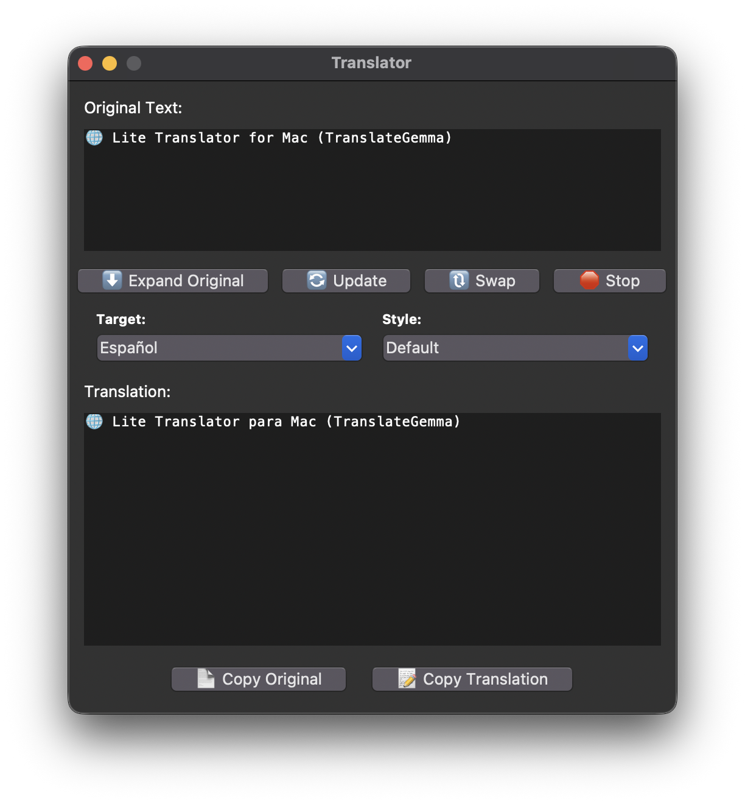

# Legacy Tkinter Version

This folder keeps the original Python/Tkinter implementation for reference.
The maintained app is now the Swift AppKit version under `App/`.

## Legacy Demo

The following demo was recorded with the legacy Tkinter interface:

https://github.com/user-attachments/assets/63cae308-71da-452e-8c8a-0f5a54464e74

## Legacy Screenshot

